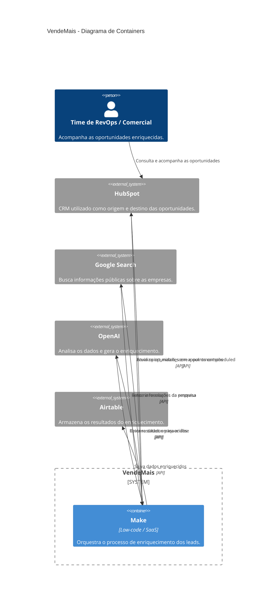

# C4 — Nível 2: Containers

O diagrama C4 de nível 2 mostra os principais componentes que participam do fluxo de enriquecimento do VendeMais e como eles se relacionam.

O HubSpot fornece as oportunidades que entram no estágio de agendamento. O Make coordena todo o processo, consultando o Google Search, enviando as informações para análise pela OpenAI, armazenando os resultados no Airtable e atualizando o negócio no HubSpot.

## Diagrama

