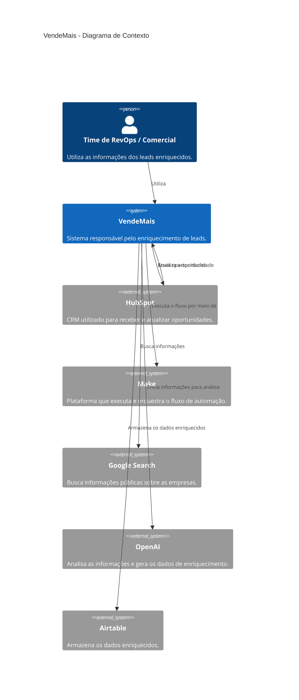

# C4 — Nível 1: Contexto

Para esta atividade, o diagrama C4 foi utilizado para representar de forma simples a estrutura do VendeMais e mostrar como os sistemas envolvidos se conectam no processo de enriquecimento dos leads.

O VendeMais apoia o time comercial no enriquecimento dos leads. O processo recebe oportunidades do HubSpot, busca informações da empresa no Google, utiliza a OpenAI para analisar os dados, salva o enriquecimento no Airtable e atualiza o negócio no HubSpot. O fluxo é orquestrado pelo Make.

## Diagrama

